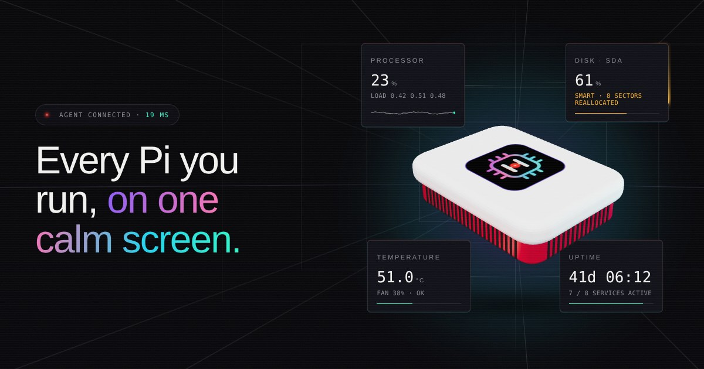
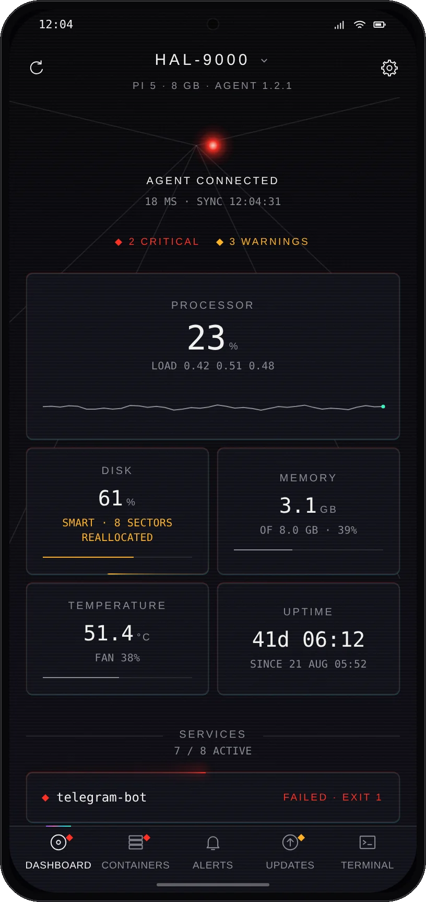
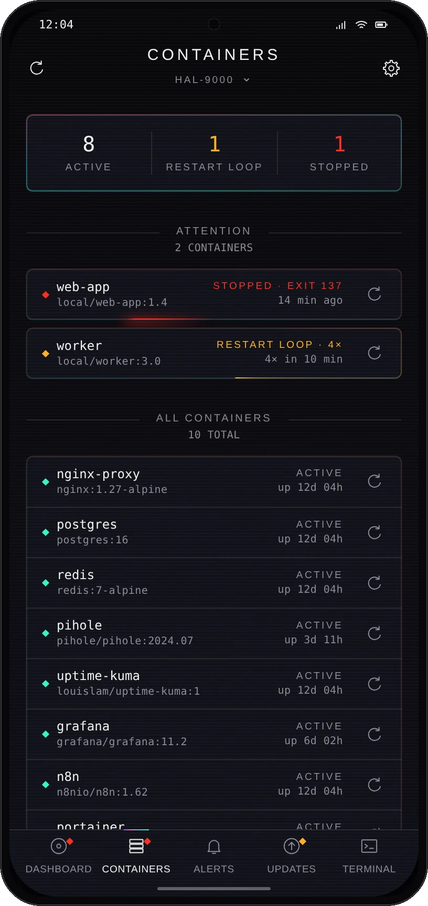
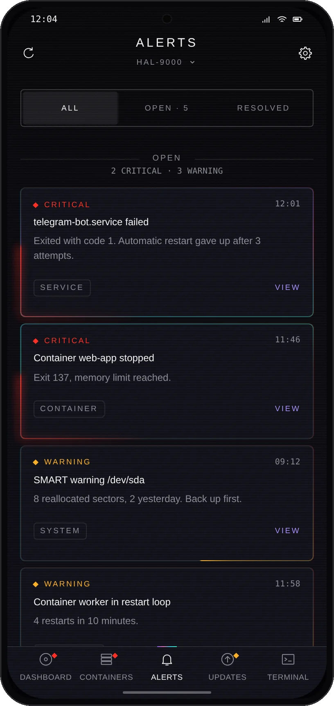
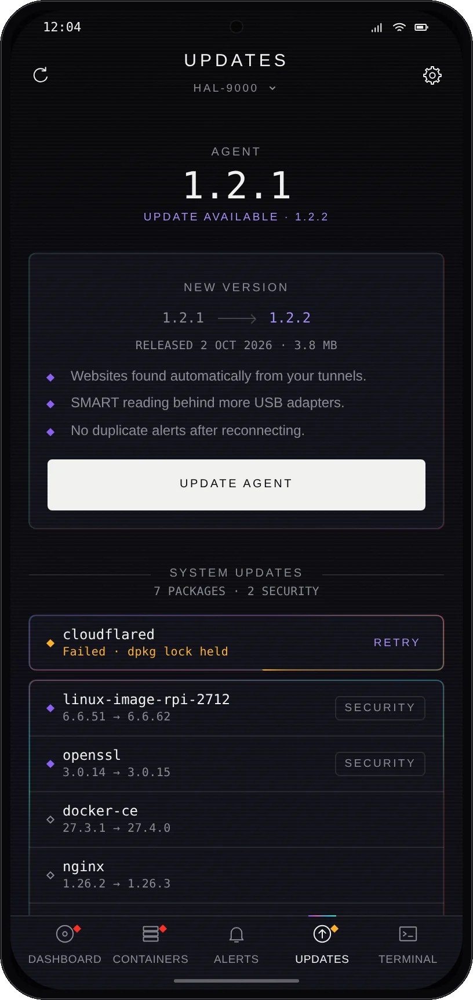
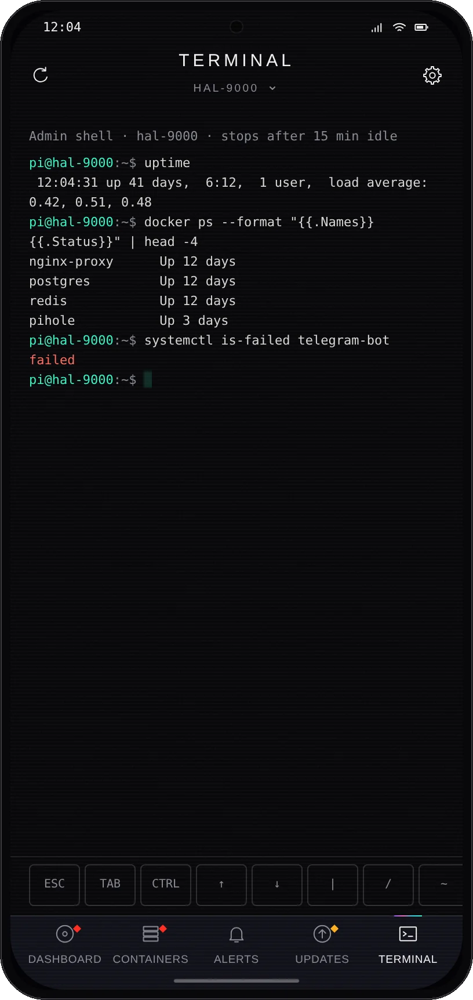
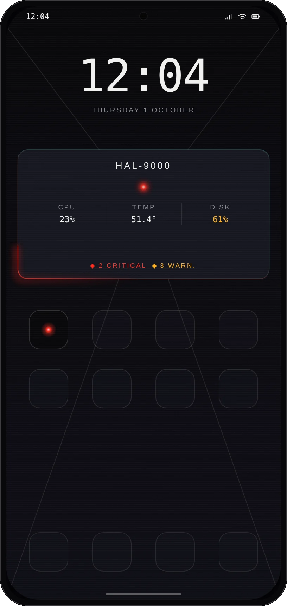
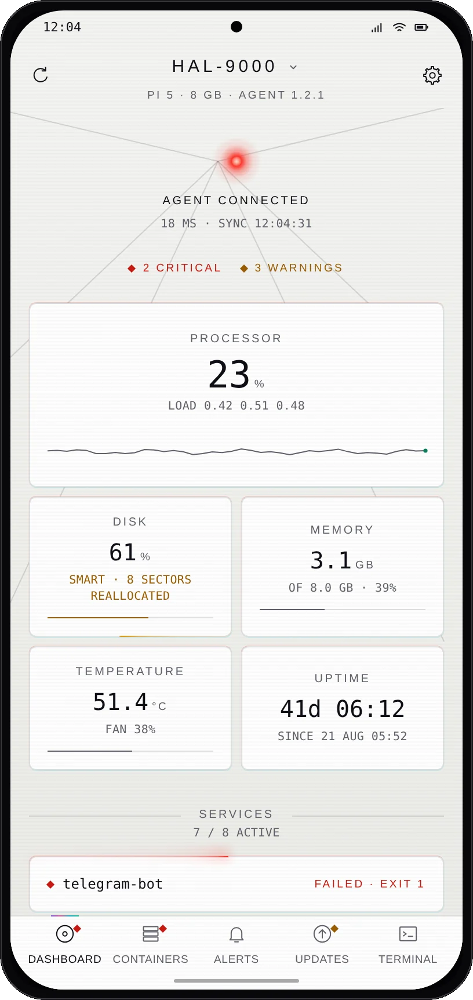
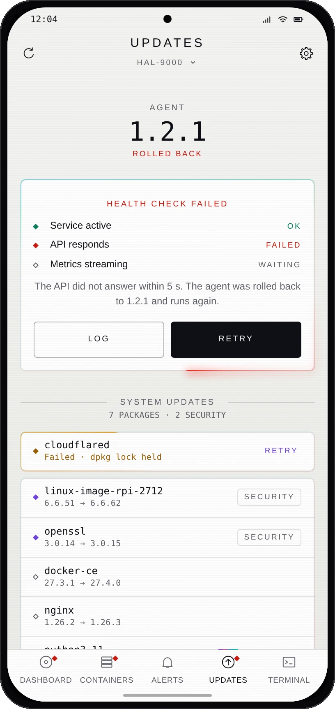
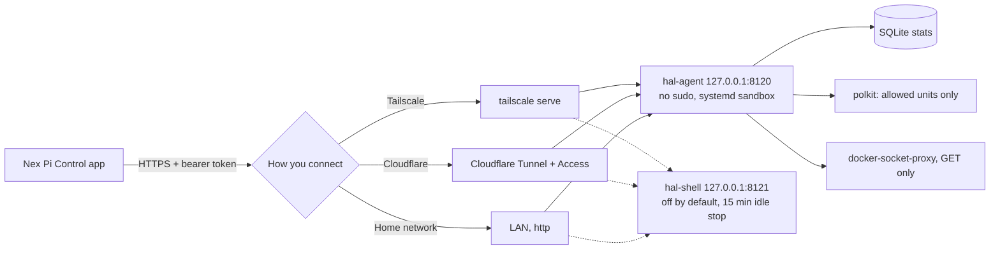

# Nex Pi Control

**Monitor and manage your Raspberry Pi from your phone. Free, open source, no account.**

[](LICENSE) [](https://play.google.com/store/apps/details?id=be.nexai.picontrol) [](#install-the-agent) [](https://nex-ai.be/apps/nex-pi-control/)



Nex Pi Control is an Android app plus a small agent that runs on your Pi. You get live monitoring, 30 days of statistics, SMART disk health, services, Docker, your websites, GPIO, sensors, your own commands and a real terminal, in one app with a dark, fast interface.

Everything runs directly between your phone and your own Pi. There is no cloud of ours in between, no tracking and no ads.

<!-- Replace with the Play Store badge once the listing is live -->
**Android:** [Google Play](https://play.google.com/store/apps/details?id=be.nexai.picontrol) · **Agent:** [install on your Pi](#install-the-agent) · **Try it first:** the app has a built-in demo, no Pi needed.

<table>
  <tr>
    <td align="center"><br><sub>Dashboard</sub></td>
    <td align="center"><br><sub>Containers</sub></td>
    <td align="center"><br><sub>Alerts</sub></td>
    <td align="center"><br><sub>Updates</sub></td>
  </tr>
  <tr>
    <td align="center"><br><sub>Terminal</sub></td>
    <td align="center"><br><sub>Widget</sub></td>
    <td align="center"><br><sub>Light theme</sub></td>
    <td align="center"><br><sub>Automatic rollback</sub></td>
  </tr>
</table>

<sub>Screens show demo data. More on the product page: [nex-ai.be/apps/nex-pi-control](https://nex-ai.be/apps/nex-pi-control/).</sub>

## What you get

| | |
|---|---|
| **Overview** | Health status with reasons, CPU, RAM, temperature, fan, load, network, disk I/O, throttling, uptime |
| **Statistics** | Every metric stored for 30 days (10 s, 1 min and 5 min resolution), charts per group, fullscreen with scrubbing, CSV export |
| **Disk health** | SMART per disk with the attributes that actually predict failure, a red banner on every screen when a disk starts failing |
| **System** | systemd services with logs and restart, Docker containers, your websites with latency and TLS expiry, processes |
| **Hardware** | GPIO header with safe switching and pulses, 1-wire, DHT and BMP280 sensors, Wake-on-LAN, pinout reference |
| **Admin mode** | Terminal with multiple tabs and snippets, file manager with editor, upload and download. Off by default, stops by itself |
| **Actions** | Your own commands, restart services and containers, power off, all with hold-to-confirm and an audit log |
| **Alerts** | The Pi keeps a log of what goes wrong and recovers (disks, services, containers, sites, security updates). Your phone turns it into notifications, for every Pi you added. No push server |
| **Updates** | System updates (apt) and the agent itself from the app, with backup and automatic rollback |
| **Several Pi's** | Add up to 10 servers and switch from the top of every screen |
| **Widget** | Home screen widget with status, temperature, CPU and disk |
| **Look** | Dark and light theme (follows your phone), English and Dutch |
| **Security** | Fingerprint lock, tokens in the Android Keystore, screenshots blocked on sensitive screens |

Languages: English and Dutch (follows your phone).

## How it works



The agent never needs root at runtime. Privileged actions go through polkit rules that only allow what you listed, SMART is read by a separate root timer that only writes JSON, and Docker is reached through a read-only socket proxy. The terminal runs in a separate service that is off until you start it from the app.

## Install the agent

On your Pi, choose one:

```bash
# Tailscale (recommended): encrypted, from anywhere, nothing exposed to the internet
curl -fsSL https://raw.githubusercontent.com/NexaiGuy/nex-pi-control/main/install.sh | sudo bash -s -- --tailscale

# Home network only
curl -fsSL https://raw.githubusercontent.com/NexaiGuy/nex-pi-control/main/install.sh | sudo bash -s -- --lan

# Cloudflare Tunnel + Access (you bring the tunnel)
curl -fsSL https://raw.githubusercontent.com/NexaiGuy/nex-pi-control/main/install.sh | sudo bash
```

Then run the `hal-qr` command the installer prints and scan the QR code in the app. Tokens never have to be typed or pasted.

Step by step: [Tailscale](docs/connect-tailscale.md) · [Home network](docs/connect-lan.md) · [Cloudflare](docs/connect-cloudflare.md). All agent details, updates, rollback and uninstall: [agent/README.md](agent/README.md).

The installer never changes your firewall, fail2ban, SSH or cloudflared configuration.

## Repository

| Folder | What |
|---|---|
| [`agent/`](agent) | FastAPI agent and admin shell for the Pi (Python 3.11+), setup, deploy and rollback scripts, 134 tests |
| [`app/`](app) | Android app (Expo SDK 57, React Native, TypeScript), 196 tests |
| [`docs/`](docs) | Connection guides, the privacy policy and screenshots |

## Privacy

The app has no analytics, no ads and no account. It only talks to the server addresses you enter. Tokens are stored in the Android Keystore on your phone. Full policy: [docs/privacy.md](docs/privacy.md).

## Built by Nex AI

Nex Pi Control is made and maintained by [Nex AI](https://nex-ai.be), an applied AI studio from Ghent, Belgium. We build websites, automation and AI tools for small and medium businesses, and we run them in production on our own self-hosted infrastructure. This app started as the tool we use to keep an eye on our own servers.

Want more bookings and quote requests with less manual work? Mail [info@nex-ai.be](mailto:info@nex-ai.be) to book a 30 minute call.

## License


[MIT](LICENSE) © Nex AI. Contributions are welcome, see [CONTRIBUTING.md](CONTRIBUTING.md).
